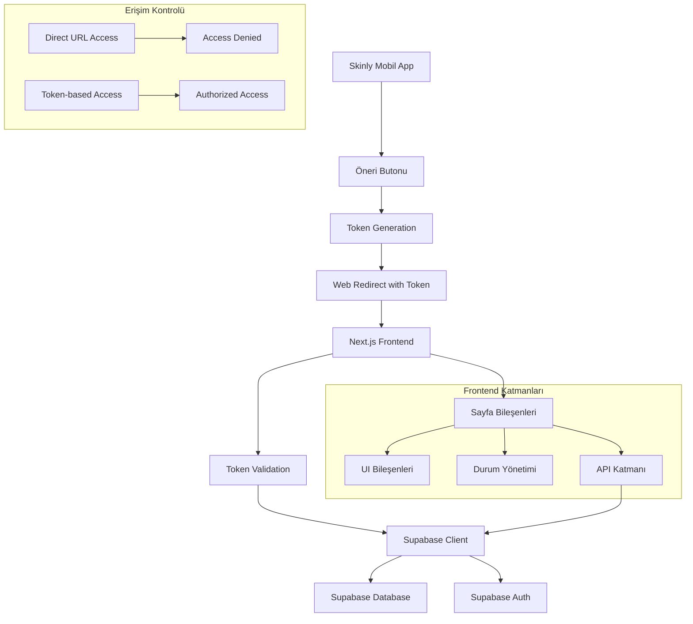

# Tasarım Belgesi

## Genel Bakış

Skinly Geri Bildirim ve Oylama Sistemi, Skinly mobil uygulaması içinden erişilebilen güvenli bir topluluk özellik istekleri platformudur. Sistem, sadece Skinly uygulaması içindeki "Öneri/Feedback" butonu üzerinden token-based authentication ile erişilebilir olacaktır. Dışarıdan doğrudan URL erişimi engellenecektir. Sistem, Next.js 15, React 19, TypeScript, Tailwind CSS ve Supabase teknolojilerini kullanarak geliştirilecektir.

## Mimari

### Sistem Mimarisi



### Teknoloji Yığını

- **Frontend Framework**: Next.js 15 (App Router)
- **UI Library**: React 19
- **Styling**: Tailwind CSS 4
- **UI Components**: Radix UI + Custom Components
- **Database**: Supabase PostgreSQL
- **Authentication**: Supabase Auth
- **Type Safety**: TypeScript
- **Animations**: Framer Motion
- **Icons**: Lucide React
- **Validation**: Zod

## Bileşenler ve Arayüzler

### Sayfa Yapısı

#### 1. Ana Geri Bildirim Sayfası (`/feedback`)

```typescript
interface FeedbackPageProps {
  initialFeedbacks: FeedbackItem[]
  user: User | null
  accessToken: string
  isAuthorized: boolean
}

interface FeedbackItem {
  id: string
  title: string
  description: string
  status: 'Beklemede' | 'Değerlendiriliyor' | 'Geliştiriliyor' | 'Yayında'
  vote_count: number
  user_id: string
  user_has_voted: boolean
  created_at: string
  updated_at: string
}

// Token doğrulama arayüzü
interface AccessTokenPayload {
  user_id: string
  email: string
  is_admin: boolean
  app_session_id: string
  issued_at: number
  expires_at: number
}
```

#### 2. Bileşen Hiyerarşisi

```
FeedbackPage
├── AccessGuard (Token doğrulama)
│   ├── UnauthorizedAccess (Hata sayfası)
│   └── AuthorizedContent
│       ├── FeedbackHeader
│       │   ├── PageTitle
│       │   └── AddFeedbackButton
│       ├── FeedbackFilters (gelecek sürüm)
│       ├── FeedbackList
│       │   └── FeedbackCard[]
│       │       ├── FeedbackContent
│       │       ├── VoteButton
│       │       ├── StatusBadge
│       │       └── FeedbackActions
│       └── AddFeedbackModal
│           ├── FeedbackForm
│           └── FormValidation
```

### Temel Bileşenler

#### 1. FeedbackCard Bileşeni

```typescript
interface FeedbackCardProps {
  feedback: FeedbackItem
  onVote: (feedbackId: string) => Promise<void>
  onDelete?: (feedbackId: string) => Promise<void>
  onStatusChange?: (feedbackId: string, status: string) => Promise<void>
  currentUser: User | null
  isAdmin: boolean
}
```

**Özellikler:**
- Responsive kart tasarımı
- Oy butonu (yukarı ok ikonu)
- Durum rozeti
- Koşullu silme butonu
- Admin durum değiştirme kontrolü
- Animasyonlu etkileşimler

#### 2. VoteButton Bileşeni

```typescript
interface VoteButtonProps {
  feedbackId: string
  voteCount: number
  hasVoted: boolean
  onVote: (feedbackId: string) => Promise<void>
  disabled?: boolean
}
```

**Özellikler:**
- Toggle işlevselliği
- Animasyonlu sayı değişimi
- Loading durumu
- Görsel geri bildirim

#### 3. AddFeedbackModal Bileşeni

```typescript
interface AddFeedbackModalProps {
  isOpen: boolean
  onClose: () => void
  onSubmit: (data: CreateFeedbackData) => Promise<void>
}

interface CreateFeedbackData {
  title: string
  description: string
}
```

**Özellikler:**
- Form validasyonu (Zod)
- Karakter sayacı
- Hata yönetimi
- Loading durumu

## Veri Modelleri

### Supabase Tablo Yapıları

#### 1. feedbacks Tablosu

```sql
CREATE TABLE feedbacks (
  id UUID DEFAULT gen_random_uuid() PRIMARY KEY,
  user_id UUID REFERENCES auth.users(id) ON DELETE CASCADE,
  title TEXT NOT NULL CHECK (char_length(title) >= 5 AND char_length(title) <= 100),
  description TEXT NOT NULL CHECK (char_length(description) >= 10 AND char_length(description) <= 500),
  status TEXT DEFAULT 'Beklemede' CHECK (status IN ('Beklemede', 'Değerlendiriliyor', 'Geliştiriliyor', 'Yayında')),
  created_at TIMESTAMP WITH TIME ZONE DEFAULT NOW(),
  updated_at TIMESTAMP WITH TIME ZONE DEFAULT NOW()
);
```

#### 2. votes Tablosu

```sql
CREATE TABLE votes (
  id UUID DEFAULT gen_random_uuid() PRIMARY KEY,
  feedback_id UUID REFERENCES feedbacks(id) ON DELETE CASCADE,
  user_id UUID REFERENCES auth.users(id) ON DELETE CASCADE,
  created_at TIMESTAMP WITH TIME ZONE DEFAULT NOW(),
  UNIQUE(feedback_id, user_id)
);
```

#### 3. admin_actions Tablosu (Moderasyon Logu)

```sql
CREATE TABLE admin_actions (
  id UUID DEFAULT gen_random_uuid() PRIMARY KEY,
  admin_id UUID REFERENCES auth.users(id),
  action_type TEXT NOT NULL, -- 'delete_feedback', 'change_status'
  target_feedback_id UUID,
  old_value TEXT,
  new_value TEXT,
  created_at TIMESTAMP WITH TIME ZONE DEFAULT NOW()
);
```

### TypeScript Arayüzleri

```typescript
// Temel veri tipleri
interface User {
  id: string
  email: string
  is_admin: boolean
}

interface FeedbackItem {
  id: string
  title: string
  description: string
  status: FeedbackStatus
  vote_count: number
  user_id: string
  user_has_voted: boolean
  created_at: string
  updated_at: string
  user?: {
    email: string
  }
}

type FeedbackStatus = 'Beklemede' | 'Değerlendiriliyor' | 'Geliştiriliyor' | 'Yayında'

interface Vote {
  id: string
  feedback_id: string
  user_id: string
  created_at: string
}

// API yanıt tipleri
interface FeedbackResponse {
  data: FeedbackItem[]
  error: string | null
}

interface VoteResponse {
  success: boolean
  vote_count: number
  user_has_voted: boolean
  error?: string
}
```

## Hata Yönetimi

### Hata Kategorileri

1. **Kimlik Doğrulama Hataları**
   - Giriş yapmamış kullanıcı
   - Oturum süresi dolmuş
   - Yetkisiz erişim

2. **Validasyon Hataları**
   - Geçersiz form verileri
   - Karakter limiti aşımı
   - Boş alanlar

3. **İş Mantığı Hataları**
   - Çift oylama girişimi
   - Yetkisiz silme işlemi
   - Oy almış içerik silme girişimi

4. **Sistem Hataları**
   - Veritabanı bağlantı hatası
   - Ağ hataları
   - Sunucu hataları

### Hata Yönetimi Stratejisi

```typescript
interface ErrorState {
  type: 'auth' | 'validation' | 'business' | 'system'
  message: string
  field?: string
  code?: string
}

// Hata yönetimi hook'u
const useErrorHandler = () => {
  const [error, setError] = useState<ErrorState | null>(null)
  
  const handleError = (error: unknown) => {
    // Hata tipine göre uygun mesaj gösterimi
  }
  
  return { error, handleError, clearError: () => setError(null) }
}
```

## Test Stratejisi

### Test Kategorileri

1. **Birim Testleri**
   - Bileşen render testleri
   - Utility fonksiyon testleri
   - Validasyon testleri

2. **Entegrasyon Testleri**
   - API çağrı testleri
   - Supabase etkileşim testleri
   - Form gönderim testleri

3. **End-to-End Testleri**
   - Kullanıcı akış testleri
   - Oylama sistemi testleri
   - Admin işlevleri testleri

### Test Araçları

- **Jest**: Birim ve entegrasyon testleri
- **React Testing Library**: Bileşen testleri
- **Playwright**: E2E testleri
- **MSW**: API mock'lama

## Performans Optimizasyonları

### Frontend Optimizasyonları

1. **React Optimizasyonları**
   - `React.memo` kullanımı
   - `useMemo` ve `useCallback` hook'ları
   - Lazy loading bileşenleri

2. **Next.js Optimizasyonları**
   - Server-side rendering
   - Static generation
   - Image optimization
   - Bundle splitting

3. **Supabase Optimizasyonları**
   - Realtime subscriptions
   - Optimized queries
   - Connection pooling

### Veritabanı Optimizasyonları

```sql
-- İndeksler
CREATE INDEX idx_feedbacks_created_at ON feedbacks(created_at DESC);
CREATE INDEX idx_feedbacks_status ON feedbacks(status);
CREATE INDEX idx_votes_feedback_id ON votes(feedback_id);
CREATE INDEX idx_votes_user_feedback ON votes(user_id, feedback_id);

-- View for optimized feedback listing
CREATE VIEW feedback_with_votes AS
SELECT 
  f.*,
  COALESCE(v.vote_count, 0) as vote_count
FROM feedbacks f
LEFT JOIN (
  SELECT feedback_id, COUNT(*) as vote_count
  FROM votes
  GROUP BY feedback_id
) v ON f.id = v.feedback_id
ORDER BY vote_count DESC, f.created_at DESC;
```

## Güvenlik Önlemleri

### Erişim Kontrolü ve Token Doğrulama

#### 1. Token-based Authentication

```typescript
// Token doğrulama middleware
export async function validateAccessToken(token: string): Promise<AccessTokenPayload | null> {
  try {
    // JWT token doğrulama
    const payload = jwt.verify(token, process.env.JWT_SECRET) as AccessTokenPayload
    
    // Token süresi kontrolü
    if (payload.expires_at < Date.now()) {
      return null
    }
    
    // Kullanıcı aktiflik kontrolü
    const { data: user } = await supabase
      .from('users')
      .select('id, is_active')
      .eq('id', payload.user_id)
      .single()
    
    if (!user?.is_active) {
      return null
    }
    
    return payload
  } catch (error) {
    return null
  }
}

// Sayfa seviyesi erişim kontrolü
export async function getServerSideProps(context: GetServerSidePropsContext) {
  const { token } = context.query
  
  if (!token || typeof token !== 'string') {
    return {
      props: {
        isAuthorized: false,
        error: 'Yetkisiz erişim. Lütfen Skinly uygulaması üzerinden erişin.'
      }
    }
  }
  
  const payload = await validateAccessToken(token)
  
  if (!payload) {
    return {
      props: {
        isAuthorized: false,
        error: 'Geçersiz veya süresi dolmuş token.'
      }
    }
  }
  
  return {
    props: {
      isAuthorized: true,
      user: payload,
      accessToken: token
    }
  }
}
```

#### 2. Client-side Erişim Kontrolü

```typescript
// AccessGuard bileşeni
const AccessGuard: React.FC<{ children: React.ReactNode; isAuthorized: boolean; error?: string }> = ({
  children,
  isAuthorized,
  error
}) => {
  if (!isAuthorized) {
    return (
      <div className="min-h-screen flex items-center justify-center bg-gray-50">
        <div className="max-w-md w-full bg-white shadow-lg rounded-lg p-6 text-center">
          <div className="mb-4">
            <svg className="mx-auto h-12 w-12 text-red-400" fill="none" viewBox="0 0 24 24" stroke="currentColor">
              <path strokeLinecap="round" strokeLinejoin="round" strokeWidth={2} d="M12 9v2m0 4h.01m-6.938 4h13.856c1.54 0 2.502-1.667 1.732-2.5L13.732 4c-.77-.833-1.964-.833-2.732 0L3.732 16.5c-.77.833.192 2.5 1.732 2.5z" />
            </svg>
          </div>
          <h3 className="text-lg font-medium text-gray-900 mb-2">Erişim Engellendi</h3>
          <p className="text-sm text-gray-500 mb-4">
            {error || 'Bu sayfaya sadece Skinly uygulaması üzerinden erişebilirsiniz.'}
          </p>
          <p className="text-xs text-gray-400">
            Skinly uygulamasını açın ve "Öneri/Feedback" butonunu kullanın.
          </p>
        </div>
      </div>
    )
  }
  
  return <>{children}</>
}
```

### Row Level Security (RLS) Politikaları

```sql
-- Feedbacks tablosu için RLS
ALTER TABLE feedbacks ENABLE ROW LEVEL SECURITY;

-- Herkes okuyabilir
CREATE POLICY "Feedbacks are viewable by everyone" ON feedbacks
  FOR SELECT USING (true);

-- Sadece kimlik doğrulaması yapılmış kullanıcılar ekleyebilir
CREATE POLICY "Users can insert their own feedbacks" ON feedbacks
  FOR INSERT WITH CHECK (auth.uid() = user_id);

-- Kullanıcılar sadece kendi oysuz geri bildirimlerini silebilir
CREATE POLICY "Users can delete their own feedbacks with no votes" ON feedbacks
  FOR DELETE USING (
    auth.uid() = user_id AND 
    id NOT IN (SELECT DISTINCT feedback_id FROM votes)
  );

-- Adminler her şeyi silebilir
CREATE POLICY "Admins can delete any feedback" ON feedbacks
  FOR DELETE USING (
    EXISTS (
      SELECT 1 FROM auth.users 
      WHERE id = auth.uid() AND raw_user_meta_data->>'is_admin' = 'true'
    )
  );
```

### Input Sanitization

```typescript
import { z } from 'zod'

const feedbackSchema = z.object({
  title: z.string()
    .min(5, 'Başlık en az 5 karakter olmalıdır')
    .max(100, 'Başlık en fazla 100 karakter olabilir')
    .trim(),
  description: z.string()
    .min(10, 'Açıklama en az 10 karakter olmalıdır')
    .max(500, 'Açıklama en fazla 500 karakter olabilir')
    .trim()
})
```

## Kullanıcı Deneyimi (UX) Tasarımı

### Responsive Tasarım

```css
/* Mobil öncelikli tasarım */
.feedback-grid {
  @apply grid gap-4;
  @apply grid-cols-1;
  @apply md:grid-cols-2;
  @apply lg:grid-cols-3;
}

.feedback-card {
  @apply p-4 md:p-6;
  @apply text-sm md:text-base;
}
```

### Animasyonlar ve Geçişler

```typescript
// Framer Motion varyantları
const cardVariants = {
  hidden: { opacity: 0, y: 20 },
  visible: { opacity: 1, y: 0 },
  exit: { opacity: 0, scale: 0.95 }
}

const voteButtonVariants = {
  idle: { scale: 1 },
  hover: { scale: 1.05 },
  tap: { scale: 0.95 },
  voted: { scale: [1, 1.2, 1] }
}
```

### Erişilebilirlik (A11y)

- ARIA etiketleri
- Klavye navigasyonu
- Ekran okuyucu desteği
- Renk kontrastı uyumluluğu
- Focus yönetimi

```typescript
// Erişilebilirlik özellikleri
<button
  aria-label={`${feedback.title} için oy ver`}
  aria-pressed={hasVoted}
  role="button"
  tabIndex={0}
>
  <ArrowUp aria-hidden="true" />
  <span className="sr-only">Oy sayısı:</span>
  {voteCount}
</button>
```

## Dağıtım ve Hosting

### Vercel Dağıtımı

- Otomatik CI/CD pipeline
- Preview deployments
- Environment variables
- Edge functions

### Environment Variables

```env
NEXT_PUBLIC_SUPABASE_URL=https://zronewujlepzmanxmtug.supabase.co
NEXT_PUBLIC_SUPABASE_ANON_KEY=eyJhbGciOiJIUzI1NiIsInR5cCI6IkpXVCJ9...
SUPABASE_SERVICE_ROLE_KEY=eyJhbGciOiJIUzI1NiIsInR5cCI6IkpXVCJ9...
JWT_SECRET=your-jwt-secret-key-for-token-validation
SKINLY_APP_API_URL=https://api.skinly.com.tr
```

### Mobil Uygulama Entegrasyonu

#### Token Generation (Mobil App Tarafında)

```typescript
// Skinly mobil uygulamasında
const generateFeedbackToken = async (userId: string) => {
  const payload: AccessTokenPayload = {
    user_id: userId,
    email: user.email,
    is_admin: user.is_admin,
    app_session_id: generateSessionId(),
    issued_at: Date.now(),
    expires_at: Date.now() + (60 * 60 * 1000) // 1 saat
  }
  
  const token = jwt.sign(payload, JWT_SECRET)
  
  // Web sayfasına yönlendirme
  const feedbackUrl = `https://skinly.com.tr/feedback?token=${token}`
  
  // In-app browser veya external browser ile açma
  openInAppBrowser(feedbackUrl)
}
```

Bu tasarım belgesi, Skinly Geri Bildirim ve Oylama Sistemi'nin teknik mimarisini, bileşen yapısını, veri modellerini ve implementasyon detaylarını kapsamlı bir şekilde tanımlamaktadır.